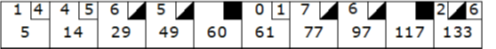
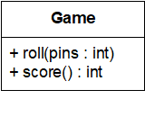
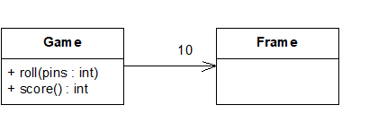
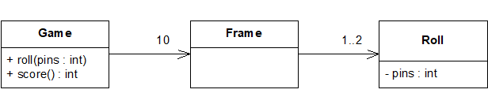
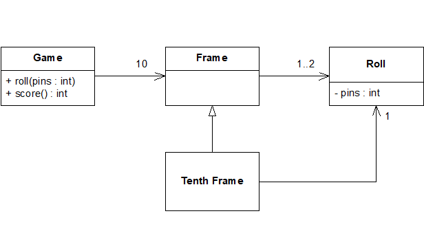
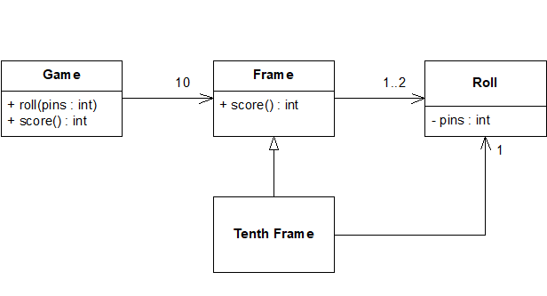
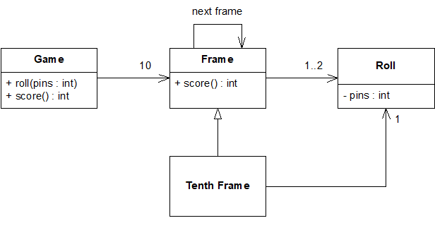

# Bowling Kata

The game consists of 10 frames as shown above. In each frame the player has two opportunities to knock down 10 pins. The score for the frame is the total number of pins knocked down, plus bonuses for strikes and spares.

A spare is when the player knocks down all 10 pins in two tries. The bonus for that frame is the number of pins knocked down by the next roll.  So in frame 3 above, the score is 10 (the total number knocked down) plus a bonus of 5 (the number of pins knocked down on the next roll.)

A strike is when the player knocks down all 10 pins on his first try. The bonus for that frame is the value of the next two balls rolled.

In the tenth frame a player who rolls a spare or strike is allowed to roll the extra balls to complete the frame. However no more than three balls can be rolled in tenth frame.

## Summarize

We can briefly summarize the scoring for this form of bowling:

- Each game, or "line" of bowling, includes ten turns, or "frames" for the bowler.
- In each frame, the bowler gets up to two tries to knock down all the pins.
- If in two tries, he fails to knock them all down, his score for that frame is the total number of pins knocked down in his two tries.
- If in two tries he knocks them all down, this is called a "spare" and his score for the frame is ten plus the number of pins knocked down on his next throw (in his next turn).
- If on his first try in the frame he knocks down all the pins, this is called a “strike”. His turn is over, and his score for the frame is ten plus the simple total of the pins knocked down in his next two rolls.
- If he gets a spare or strike in the last (tenth) frame, the bowler gets to throw one or two more bonus balls, respectively. These bonus throws are taken as part of the same turn. If the bonus throws knock down all the pins, the process does not repeat: the bonus throws are only used to calculate the score of the final frame.
- The game score is the total of all frame scores.

## The Requirements

Write a class named `Game` that has one method:

- `Roll(int pins)` is called each time the player rolls a ball. The argument is the number of pins knocked down.

And one property:

- `int Score`: called only at the very end of the game. It returns the total score for that game.

## A quick design

### A game has 10 frames

### A frame has 1 or two rolls

### The tenth frame has two or three rolls

It is different from all the other frames

### The score function must iterate through all the frames, and calculate all their scores

### The score for a spare or a strike depends on the frame’s successor

